# Orquestração de Agentes de IA sobre o Fleet UI

Este documento descreve a camada de orquestração por agentes de IA construída
sobre o Fleet UI, e a infraestrutura de simulação com múltiplos robôs que a
sustenta. O objetivo é permitir que um agente de IA (via Claude/Anthropic)
planeje e execute experimentos de robótica — mover robôs, gravar/reproduzir
rotas, analisar resultados — chamando ferramentas de alto nível em vez de
tocar em ROS 2 diretamente.

## Por que essa camada existe

O Fleet UI já resolvia o problema de operar **um** robô (ou uma frota
homogênea) por uma interface web: gravar rotas, reproduzi-las, coletar
sensores, analisar repetibilidade. A pergunta que motivou este trabalho foi:
*e se, em vez de um humano clicar em botões, um agente de IA pudesse decidir
e executar essas ações — e se pudéssemos ter vários agentes, cada um
responsável por um robô da frota?*

A resposta exigiu duas peças independentes:

1. **Uma camada de agentes** que traduz instruções em linguagem natural em
   chamadas às APIs já existentes do Fleet UI, com isolamento de segurança
   por robô (um agente não pode mexer no robô de outro).
2. **Uma simulação capaz de rodar 3 robôs ao mesmo tempo**, já que a
   simulação original só suportava 1 — sem isso, os agentes teriam uma
   frota vazia para comandar.

## Arquitetura

```mermaid
flowchart TD
    User(["Usuário (linguagem natural)"])

    subgraph FE["Frontend — React"]
        Panel["AgentFleetPanel<br/>1 instrução por robô"]
    end

    subgraph API["Backend FastAPI — backend/main.py"]
        RunFleet["POST /api/agent/run_fleet<br/>N agentes, 1 por robô"]
        RunSingle["POST /api/agent/run<br/>1 agente"]
        RunCampaign["POST /api/run_campaign<br/>baseline + N réplicas + análise"]
        Hist["GET /api/agent/history"]
    end

    subgraph AG["Agentes — backend/agents/"]
        Planner["Planner<br/>tool calling (Claude API)<br/>escopado por robot_id"]
        Executor["Executor<br/>única fronteira HTTP com o Fleet UI"]
        Analyst["Analyst<br/>lê summary.json"]
    end

    subgraph ROS["ROS 2 — fleet_ws/src"]
        Orchestrator["fleet_orchestrator<br/>Nav2 client + TF buffer por robô"]
        Collector["fleet_data_collector<br/>rosbag2 por robô"]
    end

    subgraph SIM["Gazebo — 3 robôs independentes"]
        TB1["tb1 + Nav2 + SLAM"]
        TB2["tb2 + Nav2 + SLAM"]
        TB3["tb3 + Nav2 + SLAM"]
    end

    Runs[("fleet_ws/runs/&lt;run_id&gt;/analysis/<br/>summary.json")]
    History[("fleet_ws/agent_runs/*.json")]

    User --> Panel --> RunFleet
    User -.opcional.-> RunSingle
    RunFleet --> Planner
    RunSingle --> Planner
    RunCampaign --> Orchestrator
    RunCampaign --> Runs
    Planner --> Executor
    Planner --> Analyst
    Executor -->|move_robot, start_recording,<br/>replay_route, run_campaign...| Orchestrator
    Orchestrator --> TB1 & TB2 & TB3
    Orchestrator --> Collector
    Collector -->|rosbag2| Runs
    Analyst --> Runs
    RunSingle -.job concluído.-> History
    RunFleet -.job concluído.-> History
    Hist --> History
```



O ponto central do desenho: **o agente nunca fala com ROS 2 diretamente**.
Ele decide *o quê* fazer; o Executor decide *como* executar, sempre passando
pela mesma API HTTP que o frontend React já usa. Isso significa que um bug ou
alucinação do modelo não tem como emitir `cmd_vel` bruto, ler TF diretamente,
ou fazer qualquer coisa fora do conjunto de ferramentas permitido.

## Os três componentes do backend (`backend/agents/`)

- **`Executor`** — cliente HTTP assíncrono. Cada método corresponde a um
  endpoint existente do Fleet UI (`/api/go_to_point`, `/api/start_record`,
  `/api/run_config`, etc). Inclui `wait_for_job`, que faz polling de jobs
  assíncronos (record/replay) até concluir.
- **`Analyst`** — não fala com ROS nem com a API; lê os artefatos que
  `analyze_runs.py` já produz (`summary.json`) e responde perguntas como
  "qual execução teve RMSE acima de 5 cm?" ou "compara a rota A com a B".
  `diagnose_experiment` vai além de sinalizar: cruza os sinais que o
  `summary.json` já carrega (trajetória estática, duração muito diferente
  do baseline, erro concentrado só no ponto final) numa hipótese em
  linguagem natural do que pode ter dado errado — sem ler bag/TF ao vivo,
  é diagnóstico post-mortem sobre a campanha, não monitoramento em tempo
  real (isso pediria ROS rodando, escopo maior).
- **`Planner`** — o loop de tool-calling com a Claude API. Recebe uma
  instrução, decide uma sequência de chamadas a `Executor`/`Analyst`, e
  devolve o texto final mais o histórico de passos.

### Escopo por robô: como 3 agentes não pisam um no outro

`Planner` aceita um parâmetro opcional `robot_id`. Quando definido, todo
`tool_input` que contém `robot_id` (ou `config.robot`, no caso de
`run_experiment`) é **reescrito à força** para esse valor antes de executar —
mesmo que o modelo peça outro robô. Isso não depende do modelo "se
comportar": é uma restrição estrutural, aplicada em `_scope_input()` antes de
qualquer chamada real.

`POST /api/agent/run_fleet` recebe um mapa `{robot_id: instrução}` e cria um
`Planner` escopado por robô, rodando todos em paralelo via `asyncio.gather` —
são agentes **independentes**, sem coordenação entre si (nenhum vê o que os
outros estão fazendo).

## A simulação com 3 robôs

A parte mais trabalhosa não foi a camada de IA — foi descobrir que a
simulação TurtleBot4 existente (`nav2_minimal_tb4_sim`) nunca tinha sido
desenhada para múltiplos robôs.

### O problema real

O plugin `DiffDrive` do Gazebo (dentro do xacro do TurtleBot4) publica em
tópicos gz-transport **absolutos e fixos**: `/cmd_vel`, `/odom`, `tf`,
`joint_states`. Isso é verdade também para os sensores (`imu`, `scan`,
`rgbd_camera`). Nenhum desses tópicos respeita namespace.

Confirmado empiricamente antes de escrever qualquer código: spawnar um
segundo robô fazia um único `/cmd_vel` mover os dois robôs simultaneamente,
com odometria indistinguível entre eles.

### A correção

Foi feito um fork do xacro do TurtleBot4 dentro do próprio pacote
(`fleet_ws/src/fleet_orchestrator/urdf/tb4/`), prefixando os 7 tópicos
gz-transport com `/<namespace>` — comportamento idêntico ao original quando
o namespace é vazio (validado com `xacro ... namespace:=tb1` sem precisar
subir o Gazebo).

Cada robô (`tb1`, `tb2`, `tb3`) é então spawnado com seu próprio bridge
ROS↔Gazebo gerado dinamicamente (`spawn_multi_tb4.launch.py`), e roda SLAM
Toolbox + Nav2 via os launch files **originais e intocados** do
`turtlebot4_navigation` — eles já suportam `namespace` de fábrica, seguindo a
convenção padrão do Nav2 para multi-robô: tópicos de TF por-robô
(`/tb1/tf`), com `frame_id`s sem prefixo (`map`, `base_link`) dentro de cada
árvore.

Essa convenção exigiu uma mudança correspondente no `fleet_orchestrator`: ele
lia um `/tf` único com frames prefixados (`tb1/map`). Como
`tf2_ros.TransformListener` não permite escutar outro tópico que não seja
`/tf`, foi implementado manualmente um `Buffer` + inscrição por robô,
escutando `/tb{1,2,3}/tf` e consultando `map → base_link` sem prefixo.

### Verificação real, não só leitura de código

- `ros2 topic list` mostra `/tb1/*`, `/tb2/*`, `/tb3/*` isolados.
- Comandar `/tb1/cmd_vel` moveu **só** o tb1 — `/tb2/odom` ficou parado.
- `ros2 service call /go_to_point ... robot_id: tb1` navegou de verdade via
  Nav2 até o alvo.

### Limitação conhecida

Este ambiente não tem GPU. O processo `gz sim` sozinho consome ~76% de um
núcleo simulando 3 robôs com lidar renderizado por software, o que causa
instabilidade no `/clock` simulado sob carga sustentada — o `lifecycle_manager`
do terceiro robô eventualmente trava numa transição de estado. Isso é um teto
de hardware, não um bug de lógica: tb1 e tb2 sobem e navegam de forma
consistente; rodar os 3 ao mesmo tempo de forma 100% estável exigiria menos
carga por robô (lidar mais barato, costmap com resolução menor) ou uma
máquina com GPU.

`fleet_ws/src/fleet_orchestrator/config/roles.yaml` teve `tb2`/`tb3`
temporariamente marcados como `MUUT` (móveis) para esta demonstração — o
valor original era `FUUT`/`SU` (sensor fixo / unidade de suporte, que não têm
permissão de movimento). Reverter se essa semântica de papéis for necessária
de novo.

## Como rodar

```bash
# Terminal 1 — simulação com 3 robôs (Gazebo + SLAM + Nav2 por robô)
ros2 launch fleet_orchestrator turtlebot4_multi_sim.launch.py

# Terminal 2 — orquestrador + coletor de sensores
ros2 launch fleet_orchestrator fleet.launch.py

# Terminal 3 — backend (precisa de ANTHROPIC_API_KEY no ambiente)
cd backend && python main.py

# Terminal 4 — frontend
cd frontend && npm run dev
```

No frontend, o painel **"Agentes IA"** (barra de conexão, topo) permite
escrever uma instrução por robô e disparar os 3 agentes de uma vez.

## O que foi adicionado depois da primeira versão deste documento

- **`/api/status`/`/api/map` por robô** — já não é mais o próximo passo
  listado abaixo, foi feito: o backend replica o mesmo padrão de TF Buffer
  por robô do `fleet_orchestrator` e reporta `poses`/mapas de todos os
  robôs configurados em `FLEET_ROBOTS`.
- **`run_campaign`** — fecha o loop planner→campanha→análise: 1 agente pede
  "rode N repetições desta rota", o backend grava a baseline, reproduz N
  vezes, roda `analyze_runs.py` sozinho e devolve o `run_id` pronto para
  `analyze_experiment`/`compare_runs`.
- **Histórico persistido dos agentes** (`fleet_ws/agent_runs/*.json`) — os
  jobs de `/api/agent/run` e `/api/agent/run_fleet` deixaram de existir só
  em memória; sobrevivem a um restart do backend e aparecem em
  `GET /api/agent/history`.
- **Docker multi-robô + suporte a Windows** (`docker-compose.windows.yml`,
  `docker/run-all-headless-multi.sh`) — modo headless single-container que
  contorna a descoberta DDS não convergir no Docker Desktop, com
  `FLEET_ROBOTS` configurável (default 2 robôs, não 3 — ver próxima seção).

## Qualidade de código (radon + ruff + bandit)

Rodado sobre `backend/`, `fleet_ws/src/` e `fleet_ws/scripts/` (não inclui
`frontend/`, que é JS). Ferramentas isoladas numa venv, não instaladas no
projeto — rode você mesmo com `pip install radon ruff bandit` se quiser
reproduzir.

- **Complexidade ciclomática (radon cc)** — a maioria do código novo
  (`backend/agents/`, `backend/main.py`) fica em A/B (complexidade baixa).
  As funções mais complexas do repo são todas em `fleet_ws/scripts/`, no
  código **pré-existente** de análise/experimento: `analyze_runs.py:main`
  (E, 33) e `experiment_repeatability.py:cmd_record`/`cmd_replay` (F/E, 42
  e 35) — scripts CLI grandes com muitos `if`/`elif` de parsing de
  argumentos, não lógica de negócio emaranhada. Candidatos a quebrar em
  funções menores se forem mexidos de novo, mas não é uma urgência.
- **Índice de manutenibilidade (radon mi)** — só um arquivo em C:
  `experiment_repeatability.py` (0.00 — arquivo grande, muitas
  responsabilidades). Tudo em `backend/agents/` está em A com folga (49–100).
- **ruff** — 305 achados, mas **285 são só linha > 88 colunas** (o projeto
  não segue esse limite, não é um problema real). Dos ~20 restantes: imports
  não usados em `turtlebot4_sim.launch.py`, `open()` sem context manager em
  3 launch files (usam `NamedTemporaryFile(delete=False)` de propósito, pra
  o arquivo sobreviver ao `with`), e **um bug de verdade**, corrigido nesta
  sessão: `experiment_repeatability.py` usava `pathlib.Path` em
  `_replicate_export_path()` (a função por trás de `replay --repeat N`) sem
  nunca importar `Path` — `NameError` garantido sempre que alguém combinasse
  `--repeat > 1` com `--export`.
- **bandit** — 13 Low + 1 Medium, todos esperados para o que este projeto é:
  os Low são "subprocess module usado" / "processo com path parcial"
  (`ros2`, `ssh`, `xacro` — é literalmente o papel do `RosBridge`, não dá
  pra evitar). O Medium é `uvicorn.run(host="0.0.0.0")` — bind em todas as
  interfaces, necessário pro Docker multi-container acessar o backend, mas
  reforça o item de autenticação abaixo se isso algum dia rodar fora da sua
  máquina.

## Próximos passos naturais

- Autenticação/rate-limit em `/api/agent/*` — hoje qualquer um que acesse
  o backend pode disparar chamadas que gastam sua API key da Anthropic.
  Junto com o bind em `0.0.0.0` acima, é o item de segurança mais concreto
  da lista.
- Servidor MCP expondo as mesmas ferramentas do `Executor` para outros
  clientes LLM (Claude Desktop, Codex), não só o Planner interno.
- Coordenação entre agentes (hoje são independentes) para cenários onde a
  frota precisa negociar espaço/tarefas entre si.
- Testes automatizados do lado ROS 2 (`fleet_orchestrator`, o fork do
  xacro, os launch files) — hoje só `backend/agents/` tem cobertura.
