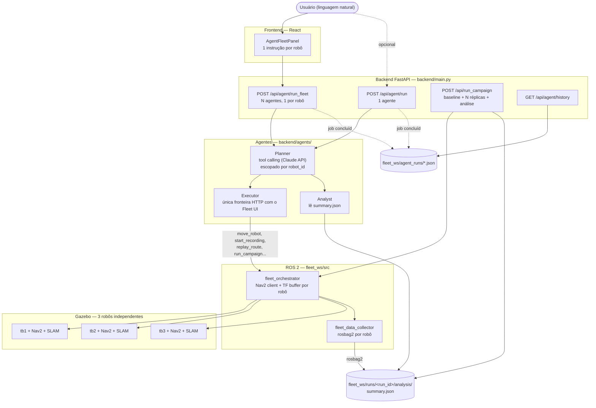

# Orquestração de Agentes de IA sobre o Fleet UI

Este documento descreve a camada de orquestração por agentes de IA construída
sobre o Fleet UI, e a infraestrutura de simulação com múltiplos robôs que a
sustenta. O objetivo é permitir que um agente de IA (via Claude/Anthropic)
planeje e execute experimentos de robótica — mover robôs, gravar/reproduzir
rotas, analisar resultados — chamando ferramentas de alto nível em vez de
tocar em ROS 2 diretamente.

## TL;DR — explicação simples (leia isto primeiro)

O **Fleet UI** é o painel onde você grava um percurso com o robô e manda ele
repetir, pra medir **repetibilidade** (o robô faz o mesmo caminho do mesmo
jeito toda vez?). Isso é o núcleo da dissertação.

Em cima disso foi adicionada uma camada de **agentes de IA**: em vez de você
clicar em botões, você escreve em português o que quer, e um agente (usando a
API da Anthropic/Claude) decide quais chamadas fazer no Fleet UI. A camada de
agentes em si não tem limite de robôs (cada agente só mexe no robô dele,
sem invadir o robô do outro) — o limite de **2 robôs simulados ao mesmo
tempo** é da simulação (Gazebo/Nav2 nesta máquina), não dos agentes; ver
"Limitação conhecida" mais abaixo.

**O que é uma "run"** (a pasta `fleet_ws/runs/<nome>/`): quando você pede
"grave esse percurso e repita 5 vezes", cada repetição é 1 execução, e o
conjunto (gravação + repetições) é 1 **campanha**. Dentro da pasta da
campanha fica `analysis/summary.json` — uma tabela com o quanto cada
repetição desviou da gravação original (RMSE, duração, etc). É o dado bruto
que vira gráfico/tabela na dissertação; já existia antes desta camada de
agentes, só que agora um agente de IA consegue rodar a campanha inteira
sozinho a partir de um pedido em linguagem natural, em vez de você rodar
comando por comando.

**Ordem cronológica do que foi construído** (cada item tem uma seção própria
mais abaixo):
1. Camada de agentes de IA (Planner decide os passos, Executor chama o Fleet
   UI de verdade, Analyst lê os resultados).
2. Simulação com múltiplos robôs ao mesmo tempo (antes só dava 1).
3. `run_campaign` — o agente roda a campanha completa (gravar + repetir N
   vezes + gerar a tabela de resultado) sozinho.
4. Histórico dos agentes salvo em disco (antes, reiniciar o programa
   apagava tudo que o agente tinha feito).
5. Testes automáticos (código que confere sozinho se tudo continua
   funcionando — pegou 2 bugs reais nesse processo).
6. `diagnose_experiment` — quando uma repetição sai muito diferente do
   esperado, o agente tenta explicar o motivo provável.

## Por que essa camada existe

O Fleet UI já resolvia o problema de operar **um** robô (ou uma frota
homogênea) por uma interface web: gravar rotas, reproduzi-las, coletar
sensores, analisar repetibilidade. A pergunta que motivou este trabalho foi:
*e se, em vez de um humano clicar em botões, um agente de IA pudesse decidir
e executar essas ações — e se pudéssemos ter vários agentes, cada um
responsável por um robô da frota?*

A resposta exigiu duas peças independentes:

1. **Uma camada de agentes** que traduz instruções em linguagem natural em
   chamadas às APIs já existentes do Fleet UI, com isolamento de segurança
   por robô (um agente não pode mexer no robô de outro).
2. **Uma simulação capaz de rodar 3 robôs ao mesmo tempo**, já que a
   simulação original só suportava 1 — sem isso, os agentes teriam uma
   frota vazia para comandar.

## Arquitetura



O ponto central do desenho: **o agente nunca fala com ROS 2 diretamente**.
Ele decide *o quê* fazer; o Executor decide *como* executar, sempre passando
pela mesma API HTTP que o frontend React já usa. Isso significa que um bug ou
alucinação do modelo não tem como emitir `cmd_vel` bruto, ler TF diretamente,
ou fazer qualquer coisa fora do conjunto de ferramentas permitido.

## Os três componentes do backend (`backend/agents/`)

- **`Executor`** — cliente HTTP assíncrono. Cada método corresponde a um
  endpoint existente do Fleet UI (`/api/go_to_point`, `/api/start_record`,
  `/api/run_config`, etc). Inclui `wait_for_job`, que faz polling de jobs
  assíncronos (record/replay) até concluir.
- **`Analyst`** — não fala com ROS nem com a API; lê os artefatos que
  `analyze_runs.py` já produz (`summary.json`) e responde perguntas como
  "qual execução teve RMSE acima de 5 cm?" ou "compara a rota A com a B".
  `diagnose_experiment` vai além de sinalizar: cruza os sinais que o
  `summary.json` já carrega (trajetória estática, duração muito diferente
  do baseline, erro concentrado só no ponto final) numa hipótese em
  linguagem natural do que pode ter dado errado — sem ler bag/TF ao vivo,
  é diagnóstico post-mortem sobre a campanha, não monitoramento em tempo
  real (isso pediria ROS rodando, escopo maior).
- **`Planner`** — o loop de tool-calling com a Claude API. Recebe uma
  instrução, decide uma sequência de chamadas a `Executor`/`Analyst`, e
  devolve o texto final mais o histórico de passos.

### Escopo por robô: como 3 agentes não pisam um no outro

`Planner` aceita um parâmetro opcional `robot_id`. Quando definido, todo
`tool_input` que contém `robot_id` (ou `config.robot`, no caso de
`run_experiment`) é **reescrito à força** para esse valor antes de executar —
mesmo que o modelo peça outro robô. Isso não depende do modelo "se
comportar": é uma restrição estrutural, aplicada em `_scope_input()` antes de
qualquer chamada real.

`POST /api/agent/run_fleet` recebe um mapa `{robot_id: instrução}` e cria um
`Planner` escopado por robô, rodando todos em paralelo via `asyncio.gather` —
são agentes **independentes**, sem coordenação entre si (nenhum vê o que os
outros estão fazendo).

## A simulação com 3 robôs

A parte mais trabalhosa não foi a camada de IA — foi descobrir que a
simulação TurtleBot4 existente (`nav2_minimal_tb4_sim`) nunca tinha sido
desenhada para múltiplos robôs.

### O problema real

O plugin `DiffDrive` do Gazebo (dentro do xacro do TurtleBot4) publica em
tópicos gz-transport **absolutos e fixos**: `/cmd_vel`, `/odom`, `tf`,
`joint_states`. Isso é verdade também para os sensores (`imu`, `scan`,
`rgbd_camera`). Nenhum desses tópicos respeita namespace.

Confirmado empiricamente antes de escrever qualquer código: spawnar um
segundo robô fazia um único `/cmd_vel` mover os dois robôs simultaneamente,
com odometria indistinguível entre eles.

### A correção

Foi feito um fork do xacro do TurtleBot4 dentro do próprio pacote
(`fleet_ws/src/fleet_orchestrator/urdf/tb4/`), prefixando os 7 tópicos
gz-transport com `/<namespace>` — comportamento idêntico ao original quando
o namespace é vazio (validado com `xacro ... namespace:=tb1` sem precisar
subir o Gazebo).

Cada robô (`tb1`, `tb2`, `tb3`) é então spawnado com seu próprio bridge
ROS↔Gazebo gerado dinamicamente (`spawn_multi_tb4.launch.py`), e roda SLAM
Toolbox + Nav2 via os launch files **originais e intocados** do
`turtlebot4_navigation` — eles já suportam `namespace` de fábrica, seguindo a
convenção padrão do Nav2 para multi-robô: tópicos de TF por-robô
(`/tb1/tf`), com `frame_id`s sem prefixo (`map`, `base_link`) dentro de cada
árvore.

Essa convenção exigiu uma mudança correspondente no `fleet_orchestrator`: ele
lia um `/tf` único com frames prefixados (`tb1/map`). Como
`tf2_ros.TransformListener` não permite escutar outro tópico que não seja
`/tf`, foi implementado manualmente um `Buffer` + inscrição por robô,
escutando `/tb{1,2,3}/tf` e consultando `map → base_link` sem prefixo.

### Verificação real, não só leitura de código

- `ros2 topic list` mostra `/tb1/*`, `/tb2/*`, `/tb3/*` isolados.
- Comandar `/tb1/cmd_vel` moveu **só** o tb1 — `/tb2/odom` ficou parado.
- `ros2 service call /go_to_point ... robot_id: tb1` navegou de verdade via
  Nav2 até o alvo.

### Limitação conhecida (teto de recursos ao rodar 3 robôs)

Hardware desta máquina: CPU AMD Ryzen 7 5800XT (8 núcleos / 16 threads), 46 GB
de RAM, GPU dedicada **AMD Radeon RX 9060 XT 8GB** (chip Navi 44, arquitetura
RDNA4/GFX1200, PCI `1002:7590`, driver de kernel `amdgpu`) — confirmado 7,95 GB
de VRAM total via `/sys/class/drm/card1/device/mem_info_vram_total`, e
identidade do chip confirmada cruzando o PCI ID com relatos públicos de bug
(o banco `pci.ids` local desta máquina está desatualizado e não tinha esse ID).

**Correção de um diagnóstico anterior:** este documento chegou a afirmar "este
ambiente não tem GPU" e atribuir a instabilidade com 3 robôs à ausência dela.
Isso estava **errado** — a máquina tem uma GPU dedicada, e foi verificado
diretamente que o `gz sim` a está usando de verdade, não caindo para
renderização por software. Evidência (comando a comando, reproduzível):

```bash
# 1. Achar o processo real do servidor gz sim (não o wrapper `sh -c ruby ...`)
pstree -p $(pgrep -f "gz sim -r -s" | head -1)

# 2. Confirmar que ele tem o dispositivo da GPU aberto
lsof -p <pid-do-gz-sim-real> | grep -i dri
# → mostra /dev/dri/renderD128 com múltiplos file descriptors ativos

# 3. Confirmar que as bibliotecas carregadas são a pilha Mesa de hardware
#    (libEGL_mesa/libGLX_mesa), não o fallback de software (swrast/llvmpipe)
grep -oE '[^ ]+\.so[^ ]*' /proc/<pid>/maps | grep -iE "mesa|gl|egl"

# 4. Prova direta do driver do kernel: percentual de uso real da GPU
cat /sys/class/drm/card1/device/gpu_busy_percent
# → valor não-zero exatamente durante a simulação
```

As quatro evidências bateram: a GPU é usada de verdade. Ou seja, o teto real
ao subir 3 robôs **não é falta de GPU** — é custo de CPU: cada robô roda seu
próprio SLAM Toolbox, controller/costmap do Nav2 e bt_navigator, e o gargalo
observado (`lifecycle_manager` do terceiro robô travando numa transição sob
carga sustentada) é consistente com contenção de CPU/DDS entre esses
processos, não com renderização de sensor. tb1 e tb2 sobem e navegam de forma
consistente; rodar os 3 de forma 100% estável ficaria mais fácil reduzindo
carga por robô (SLAM com scan-matching menos frequente, costmap com
resolução menor) ou distribuindo os processos entre mais núcleos — não
depende de trocar de máquina por uma "com GPU", porque esta já tem.

**O Nav2 e o SLAM Toolbox não usam GPU nenhuma, em hipótese nenhuma.**
Confirmado checando com `ldd` os binários reais (`controller_server`,
`planner_server`, `bt_navigator`, `smoother_server`, `behavior_server`,
`lifecycle_manager`, `async_slam_toolbox_node`, `sync_slam_toolbox_node`):
nenhum linka com CUDA, OpenCL, Vulkan ou qualquer lib gráfica. Faz sentido —
planejar rota, seguir trajetória e casar scans de lidar é geometria/álgebra
sobre poucos dados, não o tipo de carga massivamente paralela que se
beneficia de GPU (diferente da renderização do sensor lidar no Gazebo, que
usa). Ou seja: em todo o sistema, a GPU só entra pela simulação (Gazebo);
tudo que decide pra onde o robô vai é 100% CPU, e é aí que está o teto real
dos 3 robôs.

**Teste reprodutível dos 3 robôs simultâneos (2026-09-22) — falhou.** Subimos
`turtlebot4_multi_sim.launch.py` com `FLEET_ROBOTS=tb1,tb2,tb3` de propósito,
sem nenhum isolamento de CPU (sem `taskset`/cgroups), pra confirmar se dava
pra rodar os 3 de forma controlada nesta máquina como está hoje. Resultado:
os 3 (`tb1`, `tb2`, `tb3`) falharam ao ativar a navegação, um atrás do outro,
todos pelo mesmo motivo:

```
[global_costmap]: Failed to activate global_costmap because transform from
base_link to map did not become available before timeout
[lifecycle_manager_navigation]: Failed to bring up all requested nodes. Aborting bringup.
```

Causa raiz identificada no log: cada nó de SLAM Toolbox registrou quase 300
avisos de `Detected jump back in time. Clearing TF buffer` em menos de 2
minutos — o relógio simulado (`/clock`) pula pra trás sob a carga de rodar
os 3 ao mesmo tempo, o que invalida a árvore de transformações antes do Nav2
conseguir uma leitura estável de `base_link → map` dentro do prazo interno
dele. **Decisão: não perseguir estabilidade com 3 robôs simultâneos nesta
máquina.** `tb1`+`tb2` (2 robôs) continuam sendo o alvo suportado e validado
— é o default de `FLEET_ROBOTS` no código. Rodar 3 ficaria disponível via
`FLEET_ROBOTS=tb1,tb2,tb3` pra quem quiser experimentar (ex. numa máquina com
mais folga de CPU, ou testando os robôs em sequência em vez de simultâneos),
mas não é mais tratado como objetivo desta linha de trabalho.

`fleet_ws/src/fleet_orchestrator/config/roles.yaml` teve `tb2`/`tb3`
temporariamente marcados como `MUUT` (móveis) para esta demonstração — o
valor original era `FUUT`/`SU` (sensor fixo / unidade de suporte, que não têm
permissão de movimento). Reverter se essa semântica de papéis for necessária
de novo.

## Como rodar

```bash
# Terminal 1 — simulação com 3 robôs (Gazebo + SLAM + Nav2 por robô)
ros2 launch fleet_orchestrator turtlebot4_multi_sim.launch.py

# Terminal 2 — orquestrador + coletor de sensores
ros2 launch fleet_orchestrator fleet.launch.py

# Terminal 3 — backend (precisa de ANTHROPIC_API_KEY no ambiente)
cd backend && python main.py

# Terminal 4 — frontend
cd frontend && npm run dev
```

No frontend, o painel **"Agentes IA"** (barra de conexão, topo) permite
escrever uma instrução por robô e disparar os 3 agentes de uma vez.

## Validação da métrica de repetibilidade (o Nav2 mede o que a gente pensa que mede?)

Depois de estabilizar a simulação, surgiu uma pergunta mais importante que
"consigo rodar 3 robôs": **os números de RMSE/erro final que saem do
`analyze_runs.py` refletem repetibilidade real do robô, ou têm ruído
metodológico embutido que não tem nada a ver com o robô?** Duas descobertas:

### 1. Bug real, já corrigido: a análise usava a pose errada

O `fleet_data_collector` sabe gravar duas fontes de posição bem diferentes:

- **`pose`** — estimativa ao vivo do SLAM Toolbox, corrigida no referencial
  do mapa (compara scans de lidar contra o mapa construído; corrige deriva).
- **`odom`** — odometria bruta das rodas, **sem nenhuma correção**: acumula
  erro (deriva) continuamente, tanto mais quanto mais longo/demorado for o
  percurso.

O `analyze_runs.py`, no modo `--trajectory-topic auto` (o padrão), só sabia
procurar um tópico chamado literalmente `amcl_pose`. Como este projeto usa
SLAM Toolbox (não AMCL com mapa fixo), esse tópico nunca existe — e o código
caía direto pra `/odom`, **mesmo quando a pose corrigida do SLAM tinha sido
gravada**, sem avisar ninguém. Ou seja: o RMSE/erro final calculado podia
estar refletindo "quanto a odometria derivou nessa execução específica", não
"quão diferente o robô se comportou de uma repetição pra outra" — um viés
metodológico que cresceria artificialmente com rotas mais longas/demoradas,
sem que o robô tivesse feito nada de errado.

**Corrigido** (`fleet_ws/scripts/analyze_runs.py`): modo `auto` agora
prioriza `amcl_pose` > `pose` (SLAM Toolbox) > `odom`, nessa ordem, usando a
primeira que tiver mensagens gravadas de verdade. Também dá pra forçar
explicitamente com `--trajectory-topic slam_pose`. Coberto por 9 testes novos
em `tests/test_analyze_runs.py` (detecção do tópico, prioridade em `auto`,
e os três modos explícitos). **Runs analisadas antes desta correção que
caíram no fallback de `/odom` devem ser reconsideradas/re-analisadas** antes
de virarem número de dissertação, se a pose do SLAM tiver sido gravada.

### 2. Não é bug, é característica do algoritmo: o MPPI é estocástico

O controlador usado (`nav2_mppi_controller`, ver
`turtlebot4_navigation/config/nav2.yaml`) sorteia ruído gaussiano em cima da
trajetória candidata a cada ciclo de controle (20 Hz), com
`regenerate_noises: true` e desvios (`vx_std: 0.2`, `vy_std: 0.2`,
`wz_std: 0.4`) explicitamente configurados — é assim que o algoritmo MPPI
(Model Predictive Path Integral) funciona por definição, não é um parâmetro
"errado". Consequência prática: **duas execuções da mesma rota, no mesmo
robô, no mesmo ambiente, vão divergir um pouco só por causa da amostragem
aleatória do controlador** — isso não é falha de repetibilidade do sistema,
é ruído esperado do método de controle escolhido. Vale citar isso
explicitamente na seção de metodologia da dissertação, como uma fonte de
variância conhecida e não-eliminável (a menos que se troque de controlador,
ex. para um determinístico como DWB/Regulated Pure Pursuit — não avaliado
aqui).

Também vale registrar, pra quem for interpretar os números depois: o
`general_goal_checker` considera o robô "chegou" com até `xy_goal_tolerance:
0.25` m e `yaw_goal_tolerance: 0.25` rad (~14°) de folga — desvios de
endpoint dentro dessa faixa são o Nav2 funcionando como configurado, não
necessariamente falta de precisão do sistema.

## O que foi adicionado depois da primeira versão deste documento

- **`/api/status`/`/api/map` por robô** — já não é mais o próximo passo
  listado abaixo, foi feito: o backend replica o mesmo padrão de TF Buffer
  por robô do `fleet_orchestrator` e reporta `poses`/mapas de todos os
  robôs configurados em `FLEET_ROBOTS`.
- **`run_campaign`** — fecha o loop planner→campanha→análise: 1 agente pede
  "rode N repetições desta rota", o backend grava a baseline, reproduz N
  vezes, roda `analyze_runs.py` sozinho e devolve o `run_id` pronto para
  `analyze_experiment`/`compare_runs`.
- **Histórico persistido dos agentes** (`fleet_ws/agent_runs/*.json`) — os
  jobs de `/api/agent/run` e `/api/agent/run_fleet` deixaram de existir só
  em memória; sobrevivem a um restart do backend e aparecem em
  `GET /api/agent/history`.
- **Docker multi-robô + suporte a Windows** (`docker-compose.windows.yml`,
  `docker/run-all-headless-multi.sh`) — modo headless single-container que
  contorna a descoberta DDS não convergir no Docker Desktop, com
  `FLEET_ROBOTS` configurável (default 2 robôs, não 3 — ver próxima seção).

## Qualidade de código (radon + ruff + bandit)

Rodado sobre `backend/`, `fleet_ws/src/` e `fleet_ws/scripts/` (não inclui
`frontend/`, que é JS). Ferramentas isoladas numa venv, não instaladas no
projeto — rode você mesmo com `pip install radon ruff bandit` se quiser
reproduzir.

- **Complexidade ciclomática (radon cc)** — a maioria do código novo
  (`backend/agents/`, `backend/main.py`) fica em A/B (complexidade baixa).
  As funções mais complexas do repo são todas em `fleet_ws/scripts/`, no
  código **pré-existente** de análise/experimento: `analyze_runs.py:main`
  (E, 33) e `experiment_repeatability.py:cmd_record`/`cmd_replay` (F/E, 42
  e 35) — scripts CLI grandes com muitos `if`/`elif` de parsing de
  argumentos, não lógica de negócio emaranhada. Candidatos a quebrar em
  funções menores se forem mexidos de novo, mas não é uma urgência.
- **Índice de manutenibilidade (radon mi)** — só um arquivo em C:
  `experiment_repeatability.py` (0.00 — arquivo grande, muitas
  responsabilidades). Tudo em `backend/agents/` está em A com folga (49–100).
- **ruff** — 305 achados, mas **285 são só linha > 88 colunas** (o projeto
  não segue esse limite, não é um problema real). Dos ~20 restantes: imports
  não usados em `turtlebot4_sim.launch.py`, `open()` sem context manager em
  3 launch files (usam `NamedTemporaryFile(delete=False)` de propósito, pra
  o arquivo sobreviver ao `with`), e **um bug de verdade**, corrigido nesta
  sessão: `experiment_repeatability.py` usava `pathlib.Path` em
  `_replicate_export_path()` (a função por trás de `replay --repeat N`) sem
  nunca importar `Path` — `NameError` garantido sempre que alguém combinasse
  `--repeat > 1` com `--export`.
- **bandit** — 13 Low + 1 Medium, todos esperados para o que este projeto é:
  os Low são "subprocess module usado" / "processo com path parcial"
  (`ros2`, `ssh`, `xacro` — é literalmente o papel do `RosBridge`, não dá
  pra evitar). O Medium é `uvicorn.run(host="0.0.0.0")` — bind em todas as
  interfaces, necessário pro Docker multi-container acessar o backend, mas
  reforça o item de autenticação abaixo se isso algum dia rodar fora da sua
  máquina.

## Próximos passos naturais

- Autenticação/rate-limit em `/api/agent/*` — hoje qualquer um que acesse
  o backend pode disparar chamadas que gastam sua API key da Anthropic.
  Junto com o bind em `0.0.0.0` acima, é o item de segurança mais concreto
  da lista.
- Servidor MCP expondo as mesmas ferramentas do `Executor` para outros
  clientes LLM (Claude Desktop, Codex), não só o Planner interno.
- Coordenação entre agentes (hoje são independentes) para cenários onde a
  frota precisa negociar espaço/tarefas entre si.
- Testes automatizados do lado ROS 2 (`fleet_orchestrator`, o fork do
  xacro, os launch files) — hoje só `backend/agents/` tem cobertura.
